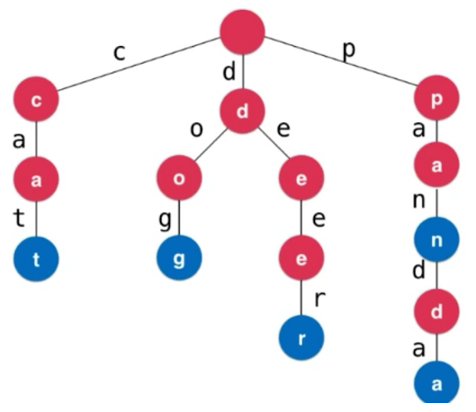
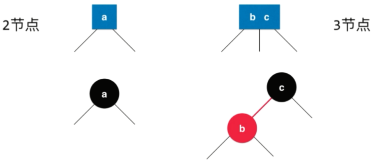
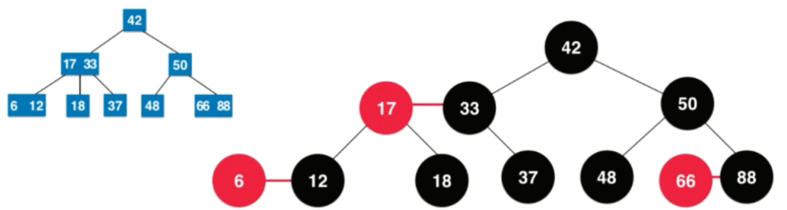

# 玩转数据结构

| 章节 | 说明 | 代码 |
| :--- | :--- | :--- |
| **一、数组** | | |
| 1-1 自定义数组 | 动态泛型数组 | [Array](src/main/java/array/Array.java) |
| **二、栈和队列** | | |
| 2-1 数组栈 | 基于数组的栈实现 | [ArrayStack](src/main/java/stack/ArrayStack.java) |
| 2-2 有效的括号 | [LeetCode(20)](https://leetcode-cn.com/problems/valid-parentheses/) | [Solution](src/main/java/stack/leetcode/Solution.java) |
| 2-3 数组队列 | 基于数组的队列实现 | [ArrayQueue](src/main/java/queue/ArrayQueue.java) |
| 2-4 循环队列 | 基于数组的循环队列实现 | [LoopQueue](src/main/java/queue/LoopQueue.java) |
| **三、最基础的动态数据结构：链表** | | |
| 3-1 链表 | 链表的基本实现 | [LinkedList](src/main/java/linkedlist/LinkedList.java) |
| 3-2 链表栈 | 使用链表实现栈 | [LinkedListStack](src/main/java/stack/LinkedListStack.java) |
| 3-3 链表队列 | 带有尾指针的链表：使用链表实现队列 | [LinkedListQueue](src/main/java/queue/LinkedListQueue.java) |
| 3-4 单链表的递归实现 | 使用递归的方式实现链表中的方法 | [RecursionLinkedList](src/main/java/linkedlist/RecursionLinkedList.java) |
| 3-5 双链表 | 双向链表的基本实现 | [待补充] |
| 3-6 循环双链表 | 循环双向链表的基本实现 | [待补充] |
| 3-7 数组链表 | 基于数组的链表基本实现 | [待补充] |
| **四、透过链表看递归** | | |
| 3-1 移除链表元素 | [LeetCode(203)](https://leetcode-cn.com/problems/remove-linked-list-elements/) | 基本解法 [BasicSolution](src/main/java/linkedlist/leetcode/Solution.java)<br/>虚拟头节点解法 [DummyHeadSolution](src/main/java/linkedlist/leetcode/Solution2.java)<br/>递归解法 [RecursionSolution](src/main/java/linkedlist/leetcode/Solution3.java)<br/> |
| 3-2 递归移除元素最简写法 | 链表实现中的removeElements方法 | [LinkedList](src/main/java/linkedlist/LinkedList.java) |
| **五、二分搜索树** | | |
| 3-1 二分搜索树 | 二分搜索树基本实现</br> 二分搜索树前中后序遍历</br> 二分搜索树非递归遍历</br> 二分搜索树层序遍历 | [BinarySearchTree](src/main/java/binarysearchtree/BinarySearchTree.java) |
| **六、集合和映射** | | |
| 6-1 集合实现一 | 基于二分搜索树的集合实现 | [BSTSet](src/main/java/set/BSTSet.java) |
| 6-2 集合实现二 | 基于链表的集合实现 | [BSTSet](src/main/java/set/LinkedListSet.java) |
| 6-3 唯一摩尔斯密码词 | [LeetCode(804)](https://leetcode-cn.com/problems/unique-morse-code-words/) | [BSTSet](src/main/java/set/leetcode/Solution.java) |
| 6-4 映射实现一 | 基于链表的映射实现 | [LinkedListMap](src/main/java/map/LinkedListMap.java) |
| 6-5 映射实现二 | 基于二分搜索树的映射实现 | [BSTMap](src/main/java/map/BSTMap.java) |
| 6-6 映射和集合 | 基于映射实现集合 | [待补充] |
| 6-7 两个数组的交集 | [LeetCode(349)](https://leetcode-cn.com/problems/intersection-of-two-arrays/) </br>[LeetCode(350)](https://leetcode-cn.com/problems/intersection-of-two-arrays-ii/) | 两个数组的交集 [Solution](src/main/java/map/leetcode/Solution.java)<br/>两个数组的交集 II [Solution](src/main/java/map/leetcode/Solution2.java) |
| [**七、优先队列和堆**](#优先队列和堆) |  |  |
| 7-1 二叉最大堆 | 二叉最大堆的数组表示实现 | [MaxHeap](src/main/java/heap/MaxHeap.java) |
| 7-2 优先队列 | 基于最大堆的优先队列实现 | [MaxHeap](src/main/java/queue/PriorityQueue.java) |
| 7-3 前K个高频元素 | [LeetCode(804)](https://leetcode-cn.com/problems/top-k-frequent-elements/) | 最大堆优先队列解法 [MaxHeap](src/main/java/queue/leetcode/Solution.java) <br/>Java自带最小堆优先队列解法 [MaxHeap](src/main/java/queue/leetcode/Solution2.java) |
| [**八、线段树**](#线段树) |  |  |
| 8-1 线段树 | 线段树的基本实现 | [SegmentTree](src/main/java/segmenttree/SegmentTree.java) |
| 8-2 区域和检索 - 数组不变 | [LeetCode(303)](https://leetcode-cn.com/problems/range-sum-query-immutable/) | 使用线段树解法 [NumArray](src/main/java/segmenttree/leetcode/NumArray.java) <br/>不使用线段树解法 [NumArray2](src/main/java/segmenttree/leetcode/NumArray2.java) |
| 8-3 区域和检索 - 数组可修改 | [LeetCode(307)](https://leetcode-cn.com/problems/range-sum-query-mutable/) | ~~不使用线段树解法(超时)~~ [NumArray3](src/main/java/segmenttree/leetcode/NumArray3.java) <br/>使用线段树解法 [NumArray4](src/main/java/segmenttree/leetcode/NumArray4.java) |
| [**九、字典树**](#字典树) |  |  |
| 9-1 字典树 | 字典树的基本实现 | [Trie](src/main/java/trie/Trie.java) |
| 9-2 实现 Trie | [LeetCode(208)](https://leetcode-cn.com/problems/implement-trie-prefix-tree/submissions/) | [Trie](src/main/java/trie/Trie.java) |
| 9-3 添加与搜索单词 | [LeetCode(211)](https://leetcode-cn.com/problems/design-add-and-search-words-data-structure/) 支持通配符 | [WordDictionary](src/main/java/trie/leetcode/WordDictionary.java) |
| 9-3 键值映射 | [LeetCode(677)](https://leetcode-cn.com/problems/map-sum-pairs/submissions/) | [MapSum](src/main/java/trie/leetcode/MapSum.java) |
| [**十、并查集**](#并查集) |  |  |
| 10-1 数组并查集 | 最简单的数组并查集 | [UnionFind1](src/main/java/unionfind/UnionFind1.java) |
| 10-2 树的并查集 | 孩子指向父亲的树并查集 | [UnionFind3](src/main/java/unionfind/UnionFind2.java) |
| 10-3 并查集优化一 | 基于size优化 | [UnionFind4](src/main/java/unionfind/UnionFind3.java) |
| 10-4 并查集优化二 | 基于rank优化 | [UnionFind5](src/main/java/unionfind/UnionFind4.java) |
| 10-5 并查集优化三 | 路径压缩优化 | [UnionFind6](src/main/java/unionfind/UnionFind5.java) |
| 10-6 并查集优化四 | 递归路径压缩优化 | [UnionFind7](src/main/java/unionfind/UnionFind6.java) |
| [**十一、平衡树和AVL树**](#平衡树和AVL) |  |  |
| 11-1 AVL树 | AVL树的基本实现 | [AVLTree](src/main/java/avl/AVLTree.java) |
| 11-2 AVL映射 | 基于AVL树的映射实现 | [AVLTree](src/main/java/map/AVLMap.java) |
| 11-3 AVL集合 | 基于AVL树的集合实现 | [AVLSet](src/main/java/set/AVLSet.java) |
| [**十二、红黑树**](#红黑树) |  |  |
| 12-1 红黑树 | 左倾红黑树简单实现 | [RedBlackTree](src/main/java/redblacktree/RedBlackTree.java) |
| [**十三、哈希表**](#红黑树) |  |  |
| 13-1 字符串中的第一个唯一字符 | [LeetCode(387)](https://leetcode-cn.com/problems/first-unique-character-in-a-string/) | [Solution](src/main/java/hashtable/leetcode/Solution.java) |
|  |  |  |

## 优先队列和堆

普通队列：先进先出，后进后出
优先队列：出队顺序和入队顺序无关，和优先级有关（动态选择优先级最高的队列）

| 实现 | 入队 | 出队（拿出最大元素） |
| :---: | :---: | :---: |
| 普通线性结构 | O(1) | O(n) |
| 顺序线性结构 | O(n) | O(1) |
| 堆 | O(log n) | O(log n) |

**堆的基本结构：**


- 二叉堆是一棵完全二叉树

  > 完全二叉树：把元素顺序排列成树的形状（一层一层从左到右排列）

- 堆中某个节点的值总是不大于其父节点的值（最大堆，反之为最小堆）

  > 最大堆：根节点最大，子节点不大于父节点
  > 最小堆：根节点最小，子节点不小于父节点

**用数组存储二叉堆：**

将二叉堆的元素逐层从左到右存放在数组中

1. 方式一：数组0索引留空


二叉堆中元素在数组中索引为 i，改元素的父子节点在数组中的索引有以下关系

```
parent(i) = i/2
left(i) = 2*i
right(i) = 2*i + 1
```

2. 方式二：数组0索引不留空


二叉堆中元素在数组中索引为 i，改元素的父子节点在数组中的索引有以下关系

```
parent(i) = (i - 1)/2
left(i) = 2*i + 1
right(i) = 2*i + 2
```

## 线段树

最经典的线段树问题：区间染色

- m次操作后，我们可以看到多少种颜色？
- m次操作后，我们可以在 [i, j] 区间内看到多少种颜色？

|  | 数组实现 | 线段树实现 |
| :---: | :---: | :---: |
| 更新 | O(n) | O(log n) |
| 查询 | O(n) | O(log n) |

线段树示意图：


- 线段树不是完全二叉树
- 线段树是平衡二叉树
- 堆也是平衡二叉树

如果区间有n个元素，数组表示需要多少个节点？

对于满二叉树，从第0层开始：

- h层，一共有 2^h-1 个节点（大约是 2^h）
- 最后一层（h-1层），有 2^(h-1) 个节点
- 最后一层的节点数大致等于前面所有层节点个数之和

如果区间有n个元素，数组表示需要多少个节点？

- 如果 n = 2^k，只需要 2n 的空间
- 最坏情况，如果 n = 2^k + 1，需要 4n 的空间

所以如果区间有n个元素，数组表示需要 4n 的空间

我们的线段树不考虑添加元素，即区间固定，使用 4n 的静态空间即可。下图为例，区间里有 5 个元素。


## 字典树

字典树可以看作专门为处理字符串的数据结构。Trie查询每个条目的时间复杂度与Trie中的条目数无关，时间复杂度为 O(w)，其中 w 为查询单词的长度。

> 对比字典，如果使用树结构，其中存储 n 个元素，查询复杂度是 O(log n)



## 并查集

并查集是一种由孩子节点指向父亲节点的树结构，可以非常高效地解决连接问题。

对于一组数据，主要支持两个动作：

- union(p，q)：合并两个元素的集合
- isConnected(p，q)：判断两个元素是否连接


上面是用数组表示并查集，数组的 index（横线上面的数字）表示元素编号，数组每个 index 处的值表示 元素的父节点 index。

如上图所示，并查集的元素组成了两个集合，集合中的元素指向父节点元素，根节点指向自己。若将两个集合 A、B 的元素合并，操作为将集合 A 的跟节点指向集合 B 的跟节点。判断两个元素是否连接，就是判断根节点是否相同。两种操作的时间复杂度都为 O(h)，h 为树的深度。

## 平衡树和AVL

AVL树是一种经典的平衡二叉树。

**平衡二叉树：**

- 对于任一节点，左子树和右子树的高度差不能超过1
- 平衡二叉树的高度和节点数量之间的关系也是 O(log n) 的

> 这里注意区别于满二叉树特征，满二叉树是平衡二叉树，但是平衡二叉树不一定是满二叉树。满二叉树要求任意两个叶子节点的高度不能超过1。


上图是一个平衡二叉树，但是不是一个满二叉树。

## 红黑树


《算法导论》中的红黑树：

1. 每个节点或者是红色的，或者是黑色的
2. 根节点是黑色的
3. 每一个叶子节点（最后的空节点）是黑色的
4. 如果一个节点是红色的，那么他的孩子节点都是黑色的 
5. 从任意一个节点到叶子节点，经过的黑色节点是一样的

红黑树与2-3树的等价行性

**什么是 2-3树？**

- 满足二分搜索树的基本性质
- 节点可以存放一个元素或两个元素
- 每个节点有2个或者3个孩子
- 2-3树是一颗绝对平衡的树（从根节点到任意一个叶子节点，经过的节点数相同）


2-3树中添加元素，永远将元素添加到空节点位置，只能融合进最后的叶子节点，再按情况变形成绝对平衡的2-3树

**红黑树和2-3树的等价关系**

2-3树中的3节点会在红黑树中形成一个红节点，具体节点对应关系如下图：



简单对应关系如下图：



转换得到成形红黑树：


**回顾红黑树性质**

1. 每个节点或者是红色的，或者是黑色的
   
   > 红黑树定义
2. 根节点是黑色的
   
   > 2-3树根节点要么是2节点要么是3节点，根据面2-3树节点和红黑树节点关系图中可知，根节点一定是黑色的
3. 每一个叶子节点（最后的空节点）是黑色的
   
   > 一个定义，定义最后的空节点为黑
4. 如果一个节点是红色的，那么他的孩子节点都是黑色的
   
   > 根据2-3树节点对应关系同样可得
5. 从任意一个节点到叶子节点，经过的黑色节点是一样的
   
   > 2-3树任意一个节点到叶子节点经过的节点数是一样多的，2-3树中每一个节点都会形成红黑树中的一个黑节点，所以红黑树中任意一个节点到叶子节点经过的黑节点一定是一样多的

上述性质中，除了1、3条是定义，别的都可以通过和2-3树的等价性推导出来

红黑树是保持“黑平衡”的二叉树，严格意义上来讲不是平衡二叉树

最大高度：2logn - O(log n)（最差情况，经过的每一个节点都是红黑相间的，即都是对应2-3树的3节点）

**红黑树中添加元素操作**


**红黑树性能总结**

- 对于完全随机的数据，普通的二分搜索树很好用。缺点是：极端形况下退化成链表（或者高度不平衡）
- 对于查询较多的使用情况，AVL树很好用
- 红黑树牺牲了平衡性（2logn的高度），统计性能更优（总和增删改查所有的操作）


